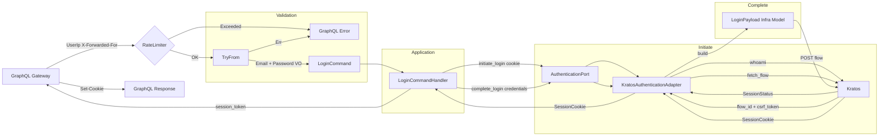
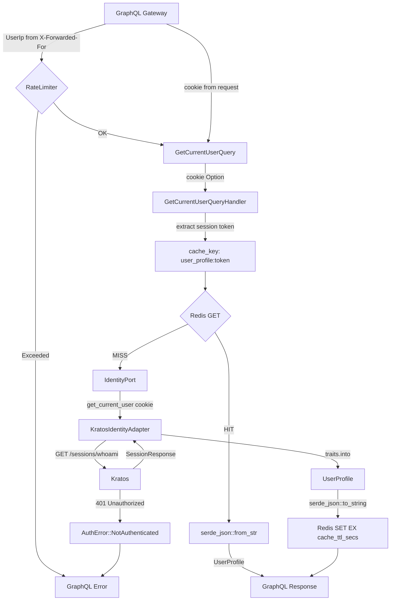
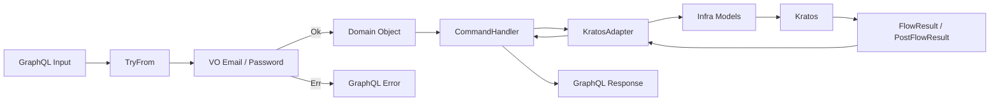

# Auth Service
[](https://sonarcloud.io/summary/new_code?id=vwency_engineer-challenge) [](https://sonarcloud.io/summary/new_code?id=vwency_engineer-challenge) [](https://sonarcloud.io/summary/new_code?id=vwency_engineer-challenge) 

## Description 
Проект реализует функции восстановление пароля, регистрация, авторизации, максимально приближенные к prod-ready решениям. С кэшированием в valkey(open source форк redis)
 
## Architecture

**DDD**  
- Фокус на доменной логике  (entities, port/in ports/out)
- Улучшенная поддерживаемость  
- Чёткое разделение бизнес-слоёв

**DI**  
- Слабая связанность компонентов  
- Упрощённое тестирование  
- Гибкость замены реализаций

**CQRS**  
- Разделение операций чтения и записи  
- Оптимизация I/O  
- Улучшенная масштабируемость  

**ADR References:**  
- [Cookie-based Session Authentication](./docs/adr/0001-cookie-session.md)  
- [GraphQL Gateway Architecture](./docs/adr/0002-graphql-gateway.md)  
- [Valkey Cache for Session Profiles](./docs/adr/0003-valkey-cache.md)  
- [Rate Limiting GraphQL](./docs/adr/0004-rate-limiting-graphql.md)

## Tech stack
1. **GraphQL**, поскольку поддерживает в запросе `Set-Cookies`, и дает Backward Compatibility.    
2. **Yarn berry** большое сообщество, кастомизация.  
3. **NX** время сборки, уменьшение времени на CI.  
4. **Rust** строгая типипизация, гарантия доставки, гибкость в архитектуре.
5. **Valkey**  Поддержка — Valkey поддерживается крупными компаниями: AWS, Google, Oracle, Ericsson. Redis Ltd. — единственный вендор Redis OSS.


## Trade-offs
1. Дублирование стилей/tsx. (скорость прототипирования), рефакторинг перед подготовкой к prod-ready.
2. Redux. (скорость прототипирования + архитектура, возможен пересмотр при разработке.  
3. Webpack (HMR, hot-reload)  как альтернатива рассматривался turbopack(нету HMR)  
4. Нет подтверждения пароля по почте при регистрации. (время отладки), рефакторинг во время разработки, сразу.  
5. Нет полноценного IaC(время), при enterprise подготовки к prod.  
6. Не использовал jwt поскольку сервис 1, нет экосистемы сервисов; сессия шарится cross-domain если cookie-based и делаем запрос с другого домена с `credentials: include`. При подготовки в prod, или масштабировании.
7. Сервис уже является bounded context
Auth-сервис сам по себе — это один BC в рамках большей системы. Дробить BC внутри сервиса — это over-engineering, если нет реальных причин.

### Continue
1. GitOps — чтение новых helm релизов и их применение.
2. Coverage тесты в CI, codecov, SonarQube.  
3. Нагрузочные тесты на GetCurrentUserQuery, Commands

Схема command запроса:


Реализация кэша redis для запрос Query, что бы не загружать postgres.


Валидация входных данных:



## Running  
```bash
make up
```

## Testing  

Для запуска тестов в kratos требуется поднятие инфры (kratos, postgres, mailhog, redis):
```bash
cd web/backend/rust_kratos && make infra-up && cargo test ; cd ../../../
```

На фронтенде:
```bash
cd web/frontend && yarn install && yarn test ; cd ../../
```
