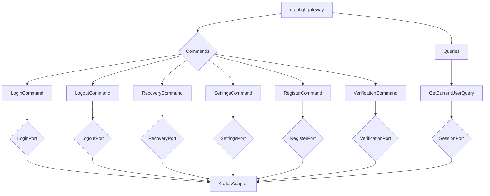

# Auth Service

[](https://sonarcloud.io/summary/new_code?id=vwency_engineer-challenge) [](https://sonarcloud.io/summary/new_code?id=vwency_engineer-challenge) [](https://sonarcloud.io/summary/new_code?id=vwency_engineer-challenge) 

## Запуск
```bash
make up
```

## Функционал

1. Регистрация
2. Авторизация
3. Восстановление по почте

### Trade-offs

1. Есть дублирование стилей/tsx. (скорость прототипирования)
2. Использование redux. (скорость прототипирования + архитектура)
3. Webpack (HMR, hot-reload)
4. Нет подтверждения пароля по почте при регистрация.(время отладки)
5. Нету полноценного IaC, выяснилось что minikube забирает себе порты нужные кластеру для cillium,
при его применении через helm, развернуть чистую ВМ с кластером долго.
6. Не использовал jwt посколько сервис 1 нету экосистемы сервисов, фикситься использованием rust_hydra

## ADR

### [backend](./backend)

GraphQL поддерживает `Set-Cookies`.
Паттерны **DDD** и **DI**.
Ory экосистема

### [frontend](./frontend)

Монорепозиторий на **webpack** (поддержка HMR), **Nx**, **Next.js**.
**Redux**

### Проблемные места

1. После login, registeration нет редиректов на homepage.
2. Нету rate-limiting.
3. Hardcode
4. Hydra если будет расти экосистема и будут отдельные сервисы для sharing-permissions

### Continue

1. GitOps чтение новых helm релизов, из применение.
2. Локальный раннер github actions.
3. Coverage тесты в ci, codecov, SonarQube

Схема упрощена, без **CommandHandler**



### Тесты

Для запуска тестов в kratos требуется поднятие инфры(kratos, postgres, mailhog)
```
cd backend/rust-kratos ; make infra-up ; cargo test
```
На фронтенде:
```
cd frontend ; yarn test
```

## PS

#### Почему не jwt/OpenID?

1. Работать с jwt не так приятно как с сессий, нужно вручную сохранять токены на frontend.
2. Безопаснее
3. Проще

#### Почему не grpc

1. Ручное сохранение ответа от gRPC на frontend в куки(в случае cookie-based).

#### Когда jwt?

1. Использование OAuth2 с OpenID, что бы была интеграция между разными сервисами 1 экосистемы,
например чтение письм пользователей в яндекс почте, яндекс телемост итд.
kratos сохраняет original токены jwt при использовании OAuth2.
