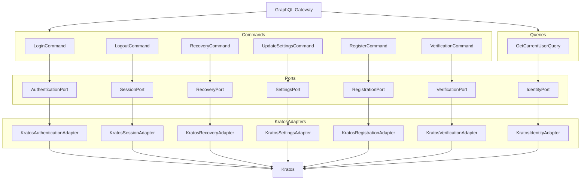

# Auth Service
[](https://sonarcloud.io/summary/new_code?id=vwency_engineer-challenge) [](https://sonarcloud.io/summary/new_code?id=vwency_engineer-challenge) [](https://sonarcloud.io/summary/new_code?id=vwency_engineer-challenge) 

## Запуск
```bash
make up
```

## Функционал
1. Регистрация
2. Авторизация
3. Восстановление по почте

### Trade-offs
1. Есть дублирование стилей/tsx. (скорость прототипирования)
2. Использование redux. (скорость прототипирования + архитектура)
3. Webpack (HMR, hot-reload)
4. Нет подтверждения пароля по почте при регистрации. (время отладки)
5. Нет полноценного IaC, minikube не очень хорош для bare metal развёртки.
6. Не использовал jwt поскольку сервис 1, нет экосистемы сервисов; сессия шарится cross-domain если cookie-based и делаем запрос с другого домена с `credentials: include`.

## ADR

### [backend](./backend)
GraphQL поддерживает `Set-Cookie`.
Паттерны **DDD** и **DI**.
Ory экосистема.

### [frontend](./frontend)
Монорепозиторий на **Webpack** (поддержка HMR), **Nx**, **Next.js**.
**Redux**.

### Проблемные места
1. После login/registration нет редиректов на homepage.
2. Нет rate-limiting.
3. Hardcode.
4. Hydra — если будет расти экосистема и появятся отдельные сервисы для sharing-permissions.

### Continue
1. `rust_hydra` — централизованный сервис по валидации и извлечению user traits из access_token.
2. Имплементация OpenID compatibility.
3. GitOps — чтение новых helm релизов и их применение.
4. Локальный раннер GitHub Actions.
5. Coverage тесты в CI, codecov, SonarQube.

Схема упрощена, без **CommandHandler**:


## Тесты

Для запуска тестов в kratos требуется поднятие инфры (kratos, postgres, mailhog):
```bash
cd backend/rust_kratos && make infra-up && cargo test
```

На фронтенде:
```bash
cd frontend && yarn test
```

## PS

#### Почему не JWT/OpenID?
1. Работать с JWT не так удобно как с сессиями — нужно вручную сохранять токены на frontend.
2. Сессии безопаснее.
3. Проще в реализации.

#### Почему не gRPC?
1. При cookie-based подходе нужно вручную сохранять ответ от gRPC в куки на frontend.

#### Когда JWT?
1. При использовании OAuth2 с OpenID для интеграции между сервисами одной экосистемы — например чтение писем пользователя в Яндекс Почте, Яндекс Телемост и т.д. Kratos сохраняет оригинальные JWT токены при использовании OAuth2.
