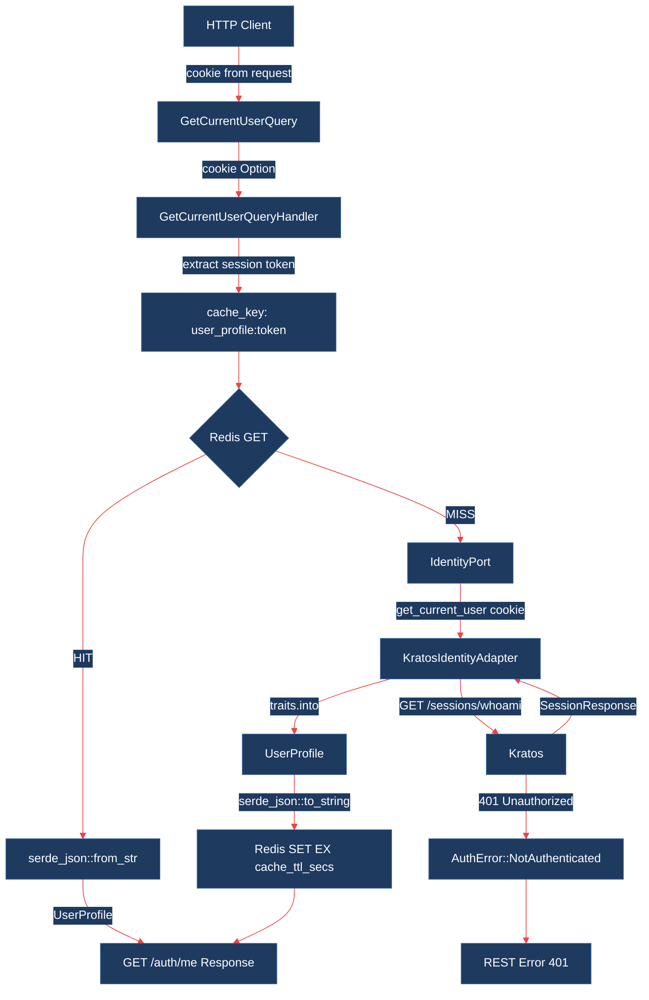
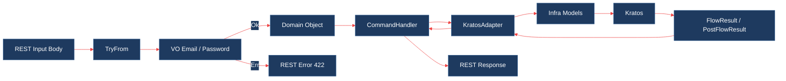
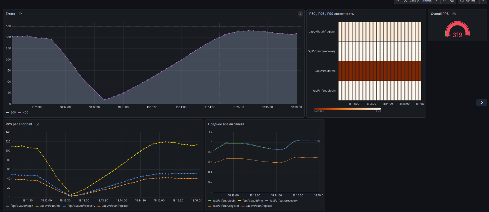
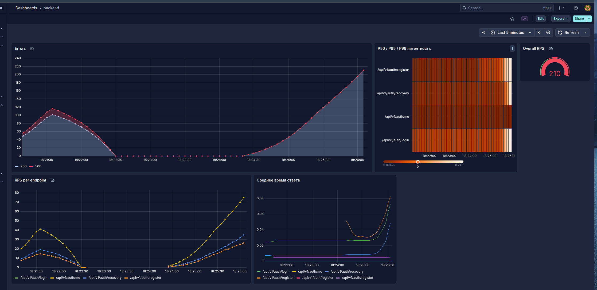

# Auth Service

<div align="left">

  <!-- CI/CD -->
  <a href="https://github.com/vwency/engineer-challenge/actions/workflows/backend-push.yaml"></a>
  <a href="https://github.com/vwency/engineer-challenge/actions/workflows/frontend-push.yaml"></a>

  <!-- Code quality -->
  <a href="https://sonarcloud.io/summary/new_code?id=vwency_engineer-challenge"></a>
  <a href="https://sonarcloud.io/summary/new_code?id=vwency_engineer-challenge"></a>
  <a href="https://sonarcloud.io/summary/new_code?id=vwency_engineer-challenge"></a>

  <!-- Meta -->
  <a href="https://github.com/vwency/engineer-challenge/blob/main/LICENSE"></a>
  

</div>

## Description
The project implements password recovery, registration, and authentication features, designed to be as close as possible to production-ready solutions. It includes caching using Valkey (an open-source fork of Redis).

## Overview

A modular structure where each module contains its own README, Dockefile and `.env.example`.

Modules

| Module | Description |
|---|---|
| [`rust_kratos`](https://github.com/justventure/rust_kratos/tree/main) | Main API |
| [`frontend`](./web/frontend) | Frontend |
| [`k6_tests`](./web/backend/k6_tests) | k6 load testing |

---

<details>
<summary><strong>Architecture</strong></summary>  
<br>

| Pattern | Effects |
|---|---|
| Hexagonal architecture | Decoupling implementation from transport via ports |
| DDD | Focus on domain logic, clear separation of business layers |
| DI | Loose coupling, flexibility in replacing implementations |
| CQRS | Separation of reads/writes, I/O optimization, scalability |

</details>

---  

<details>
<summary><strong>Tech stack</strong></summary>
<br>
    
| Technology | Reason |
|---|---|
| Yarn Berry | Large community, flexible customization |
| NX | Faster builds, reduced CI time |
| Rust | Strong typing, correctness guarantees, architectural flexibility |
| Valkey | Supported by AWS, Google, Oracle, Ericsson — unlike Redis OSS, which is backed by a single vendor (Redis Ltd.) |

</details>

---

<details>
<summary><strong>Key decisions</strong></summary>
<br>
    
| feature | description |
|---|---|
| Backpressure | For better resilience, consider hybrid backpressure (infrastructure + application level). The application should monitor OS backlog and enforce connection limits for safer load handling. |
| Caching | Without caching, Postgres can become an I/O bottleneck under load. |
| REST | Supports standard status codes, more flexible than GraphQL (headers, params, cookies), and less CPU-intensive. |

</details>

---

<details>
<summary><strong>Trade-offs</strong></summary>
<br>

| Decision | Reason | When to Revisit |
|---|---|---|
| Duplication of styles/TSX | Faster prototyping | Before preparing for production readiness |
| Redux | Faster prototyping + architecture | May be reconsidered during development |
| Webpack (HMR, hot-reload) | HMR out of the box; Turbopack does not support it | When HMR becomes available in Turbopack |
| No email password confirmation during registration | Debugging time constraints | Refactor during development |
| No full Infrastructure as Code (IaC) | Time constraints | During enterprise-level production preparation |
| Cookie-based sessions instead of JWT | Single service, no ecosystem | When scaling or adding new services |
| Auth service as a single Bounded Context | Splitting BC would be over-engineering | When separating into distinct subdomains |
| Ory ecosystem | Flexible configuration and integration with Hydra for OpenID | At enterprise+ stage |

</details>

---  


<details>
<summary><strong>Roadmap</strong></summary>
<br>

1. GitOps — reading new Helm releases and applying them  
2. Coverage tests in CI, Codecov, SonarQube  
3. Load testing for GetCurrentUserQuery and Commands  
4. SLA  

</details>

---

<details>
<summary><strong>Diagrams</strong></summary>
<br>
Command request schema:


```mermaid
%%{init: {'theme': 'base', 'themeVariables': {'primaryColor': '#1E3A5F', 'primaryTextColor': '#FFFFFF', 'primaryBorderColor': '#2D5A8E', 'lineColor': '#EF4444', 'secondaryColor': '#162D4A', 'tertiaryColor': '#0F1F35', 'clusterBkg': '#0F1F35', 'clusterBorder': '#2D5A8E', 'titleColor': '#FFFFFF', 'edgeLabelBackground': '#1E3A5F', 'nodeTextColor': '#FFFFFF'}}}%%
flowchart LR
    Client[HTTP Client]
    Client -->|Email + Password| TryFrom
    subgraph Validation
        TryFrom -->|Email + Password VO| LoginCommand
        TryFrom -->|Err| RestError[REST Error 422]
    end
    subgraph Application
        LoginCommand --> LoginCommandHandler
    end
    subgraph Initiate
        LoginCommandHandler -->|initiate_login cookie| AuthenticationPort
        AuthenticationPort --> KratosAuthenticationAdapter
        KratosAuthenticationAdapter -->|whoami| Kratos
        Kratos -->|SessionStatus| KratosAuthenticationAdapter
        KratosAuthenticationAdapter -->|fetch_flow| Kratos
        Kratos -->|flow_id + csrf_token| KratosAuthenticationAdapter
    end
    subgraph Complete
        LoginCommandHandler -->|complete_login credentials| AuthenticationPort2[AuthenticationPort]
        AuthenticationPort2 --> KratosAuthenticationAdapter2[KratosAuthenticationAdapter]
        KratosAuthenticationAdapter2 -->|build| LoginPayload[LoginPayload Infra Model]
        LoginPayload -->|POST flow| Kratos2[Kratos]
        Kratos2 -->|SessionCookie| KratosAuthenticationAdapter2
    end
    KratosAuthenticationAdapter -->|SessionCookie| LoginCommandHandler
    LoginCommandHandler -->|session_token| Client
    Client -->|Set-Cookie| RestResponse[POST /auth/login Response]
```

Implementation of a Redis cache for Query requests to reduce load on PostgreSQL.

```mermaid
%%{init: {'theme': 'base', 'themeVariables': {'primaryColor': '#1E3A5F', 'primaryTextColor': '#FFFFFF', 'primaryBorderColor': '#2D5A8E', 'lineColor': '#EF4444', 'secondaryColor': '#162D4A', 'tertiaryColor': '#0F1F35', 'clusterBkg': '#0F1F35', 'clusterBorder': '#2D5A8E', 'titleColor': '#FFFFFF', 'edgeLabelBackground': '#1E3A5F', 'nodeTextColor': '#FFFFFF'}}}%%
flowchart TD
    Client[HTTP Client]
    Client -->|cookie from request| GetCurrentUserQuery
    GetCurrentUserQuery -->|cookie Option| GetCurrentUserQueryHandler
    GetCurrentUserQueryHandler -->|extract session token| CacheKey[cache_key: user_profile:token]
    CacheKey --> RedisLookup{Redis GET}
    RedisLookup -->|HIT| Deserialize[serde_json::from_str]
    Deserialize -->|UserProfile| RestResponse[GET /auth/me Response]
    RedisLookup -->|MISS| IdentityPort
    IdentityPort -->|get_current_user cookie| KratosIdentityAdapter
    KratosIdentityAdapter -->|GET /sessions/whoami| Kratos
    Kratos -->|401 Unauthorized| AuthError[AuthError::NotAuthenticated]
    AuthError --> RestError[REST Error 401]
    Kratos -->|SessionResponse| KratosIdentityAdapter
    KratosIdentityAdapter -->|traits.into| UserProfile
    UserProfile -->|serde_json::to_string| RedisSet[Redis SET EX cache_ttl_secs]
    RedisSet --> RestResponse
```

Input data validation:

```mermaid
%%{init: {'theme': 'base', 'themeVariables': {'primaryColor': '#1E3A5F', 'primaryTextColor': '#FFFFFF', 'primaryBorderColor': '#2D5A8E', 'lineColor': '#EF4444', 'secondaryColor': '#162D4A', 'tertiaryColor': '#0F1F35', 'clusterBkg': '#0F1F35', 'clusterBorder': '#2D5A8E', 'titleColor': '#FFFFFF', 'edgeLabelBackground': '#1E3A5F', 'nodeTextColor': '#FFFFFF'}}}%%
flowchart LR
    Input[REST Input Body]
    Input --> TryFrom[TryFrom]
    TryFrom --> VO[VO Email / Password]
    VO -->|Ok| Domain[Domain Object]
    VO -->|Err| Error[REST Error 422]
    Domain --> Handler[CommandHandler]
    Handler --> Adapter[KratosAdapter]
    Adapter --> Models[Infra Models]
    Models --> Kratos[Kratos]
    Kratos --> Response[FlowResult / PostFlowResult]
    Response --> Adapter
    Adapter --> Handler
    Handler --> RestResponse[REST Response]
```
</details>

---  

<details>
<summary><strong>Running & tests</strong></summary>
<br>
    
## Running  
```bash
make up
```

## Testing  

To run tests in Kratos, the infrastructure must be started (Kratos, PostgreSQL, MailHog, Redis):
```bash
cd web/backend/rust_kratos && make infra-up && cargo test ; cd ../../../
```

frontend testing:
```bash
cd web/frontend && yarn install && yarn test ; cd ../../
```
</details>

---  

<details>
<summary><strong>Load tests</strong></summary>
<br>

```bash
✓ register 2xx
✗ register <500ms
 ↳  38% — ✓ 2542 / ✗ 4023
✓ login 2xx
✓ me 200
✓ recovery 2xx

checks.........................: 93.06% 53997 out of 58020
data_received..................: 30 MB  129 kB/s
data_sent......................: 18 MB  78 kB/s
dropped_iterations.............: 16278  70.773582/s
http_req_blocked...............: avg=7.38µs   min=1.09µs   med=3.73µs  max=17.89ms p(90)=4.95µs  p(95)=5.54µs
http_req_connecting............: avg=2.2µs    min=0s       med=0s      max=11.48ms p(90)=0s      p(95)=0s
✗ http_req_duration..............: avg=595.27ms min=218.27µs med=45.68ms max=4.05s   p(90)=1.68s   p(95)=1.95s
  { expected_response:true }...: avg=595.27ms min=218.27µs med=45.68ms max=4.05s   p(90)=1.68s   p(95)=1.95s
✓ http_req_failed................: 0.00%  0 out of 51455
http_req_receiving.............: avg=69.05µs  min=7.69µs   med=39.46µs max=44.12ms p(90)=66.09µs p(95)=125.44µs
http_req_sending...............: avg=26.99µs  min=3.66µs   med=14.71µs max=89.34ms p(90)=20.89µs p(95)=25.27µs
http_req_tls_handshaking.......: avg=0s       min=0s       med=0s      max=0s      p(90)=0s      p(95)=0s
http_req_waiting...............: avg=595.17ms min=191.94µs med=45.45ms max=4.05s   p(90)=1.68s   p(95)=1.95s
http_reqs......................: 51455  223.716346/s
iteration_duration.............: avg=1.02s    min=106.35ms med=1.09s   max=4.15s   p(90)=1.96s   p(95)=2.21s
iterations.....................: 33121  144.003675/s
vus............................: 0      min=0              max=300
vus_max........................: 300    min=50             max=300
```

Latency degradation (p50, p95, p99)



Start of degradation of a single instance:  


</details>
